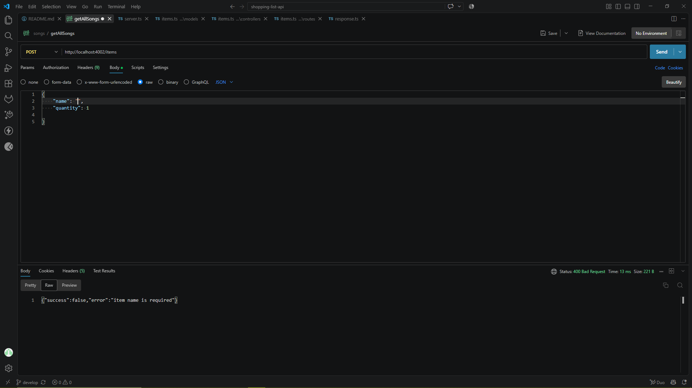
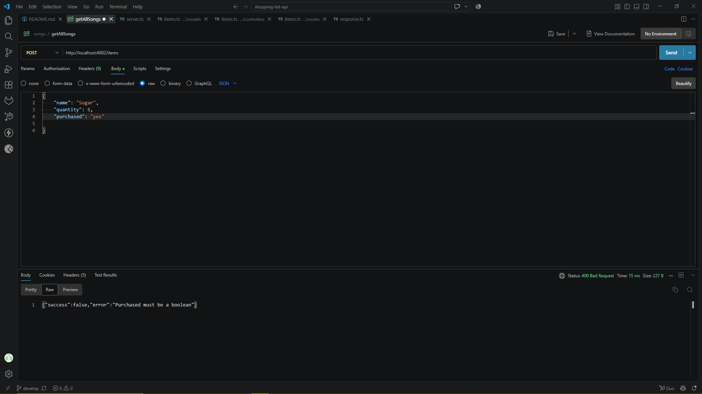

# Shopping List API

A REST API built with **Node.js** and **TypeScript** that allows users to manage list items through HTTP requests.

The API supports creating, viewing, updating, and deleting shopping list items. Data is stored **in memory**, so all items are reset whenever the server restarts.

---

## Project Overview

The purpose of this project is to build a simple shopping list REST API.

Users can interact with the API using tools such as **Postman**

The API allows users to:

- Add shopping list items
- View all shopping list items
- View a single item by ID
- Update an item's name, quantity, or purchased status
- Delete items
- Receive validation errors for invalid input

Example items:

```JSON
{
    "id": 1,
    "name": "Milk",
    "quantity": 2,
    "purchased": false
}
```

---

## Technologies Used

- Node.js
- TypeScript
- Node.js built-in HTTP module
- Nodemon
- ts-node
- Postman

---

## Project Structure

```text
shopping-list-api
    dist/
        controllers/
            items.js
            items.js.map
        models/
            items.js
            items.js.map
        routes/
            items.js
            items.js.map
        server.js
        server.ja.map
    node_module/
    src/
        assets/
        controllers/
            items.ts
        models/
            items.ts
        routes/
            items.ts
        server.ts
    package-lock.json
    package.json
    README.md
    tsconfig.json

```

### Project structure screenshot


---

## Item Model

```ts

export interface Item {
    id: number;
    name: string;
    quantity: number;
    purchased: boolean;
}

```

| Property | Type | Description |
|---|---|---|
| `id` | number | Unique ID generated by the server |
| `name` | string | Name of the shopping item |
| `quantity` | number | Quantity required |
| `purchased` | boolean | Shows whether the item ha been purchased |

---

## Installation

Clone the repository

```bash

git clone https://github.com/surprise2024-cpu/shopping-list-api.git

```

Move into the project folder:

```bash

cd shopping-list-api

```

Install dependencies

```bash

npm install

```

---

## Running the Project

To run the application in development mode:

```bash

npm run dev

```

The server runs on:

```text

http://localhost:4002

```

### Server Running 


---

## Build the project

Compile the TypeScript project:

```bash

npm run build

```

Compiled JavaScript files are generated inside the:

```text

dist/

```

folder.

To run the compiled application:

```bash

npm start

```

---

## API Endpoints

| Method | Endpoint | Description |
|---|---|---|
| POST | `/items` | Add a new shopping list item |
| GET | `/items` | Retrieve all shopping list items |
| GET | `/items/:id` | Retrieve a single item by id  |
| PUT | `/items/:id` | Update an existing item |
| DELETE | `/items:id` | Delete an item |

Base URL: 

```text

http://localhost:4002

```

---

### POST /items `screenshot`


The `purchased` value is optional and it's automatically set to `false`.

---

### GET /items `screenshot`

Retrieve all items from the list.


---

### GET single item `screenshots`

Retrieve Item 1:


Retrieve Item 2:


---

### PUT /items/:id `screenshots`

Retrieve item by id then update that item.

---

Before:

Item 1 before update:


After:

Item 1 after update:


---

Before:

Item 2 before update:


After:

Item 1 after update:


---

### DELETE /items/:id `screenshots`

Delete an item using its ID.

Before:

Items before deletion:


Process:


After:

Items after deletion:


---

## Validation

The API validates incoming request data.

### Name validation

The item name: 

- is required when creating an item
- must be a string
- cannot be empty

Invalid example:

```JSON

{
    "name": "",
    "quantity": 2
}

```

---

### Quantity Validation

The quantity:

- must be a number
- must be greater than 0

Invalid example:

```JSON

{
    "name": "Milk",
    "quantity": -5
}

```

### Purchased Validation

The `purchased` must be a boolean.

Valid: 

```JSON

{
    "purchased": true
}

```

Invalid: 

```JSON

{
    "purchased": "yes"
}

```

---

### Validation Error Example

Status: 

```text

400 Bad Request

```

Example response:

```JSON 

{
    "success": false,
    "error": "Quantity must be greater than 0"
}

```

### Validation Error in Postman

Name validation:



Quantity validation: 


Purchase validation:



---

## Error Handling

The API returns appropriate HTTP status codes when errors occur.

| Status | Meaning |
|---|---|
| `200 ok` | Request completed successfully |
| `201 Created` | Item created successfully |
| `204 No Content` | Item deleted successfully |
| `400 Bad Request` | Invalid input |
| `404 Not Found` | Item or route not found |
| `405 Method Not Allowed` | HTTP method is not supported |

---

## Testing with Postman

The API was tested using Postman.

A recommended testing order is:

1. Create am item using `POST /items`
2. Retrieve all items using `GET /items`
3. Retrieve one item using `GET /items/:id`
4. Update the item using `PUT /items`
5. Retrieve the item againto confirm the update.
6. Delete the item using `DELETE /items/:id`
7. Try retrieving the deleted item and confirm that `404` is returned.

---

## Recommended Test Case

| Test | Expected Result |
|---|---|
| POST valid item | `201 Created` |
| POST missing name | `400 Bad Request` |
| POST quantity below 1 | `400 Bad Request` |
| POST purchased with "yes/no" | `400 Bad Request` |
| GET all items | `200 OK` |
| GET existing item | `200 OK` |
| GET missing item | `400 Bad Request` |
| GET invalid id | `400 Bad Request` |
| PUT existing item | `200 OK` |
| PUT invalid data | `400 Bad Request` |
| PUT missing item | `404 Not Found` |
| DELETE existing item | `204 No Content` |
| DELETE missing item | `404 Not Found` |

---

## Author

Shopping List API built using Node.js and TypeScript.


