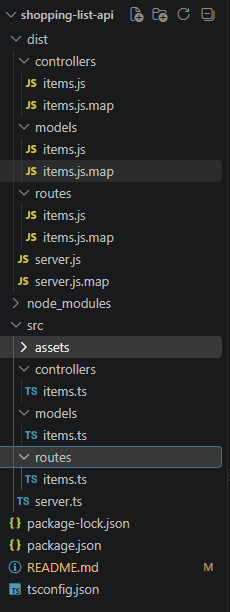
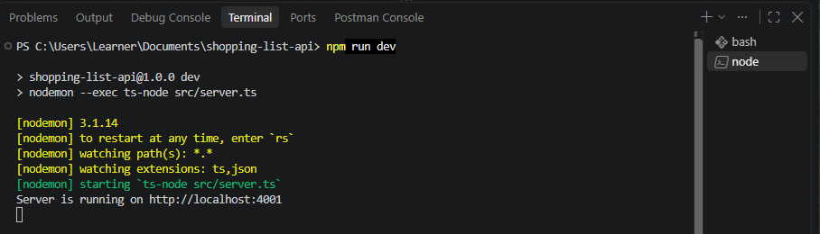
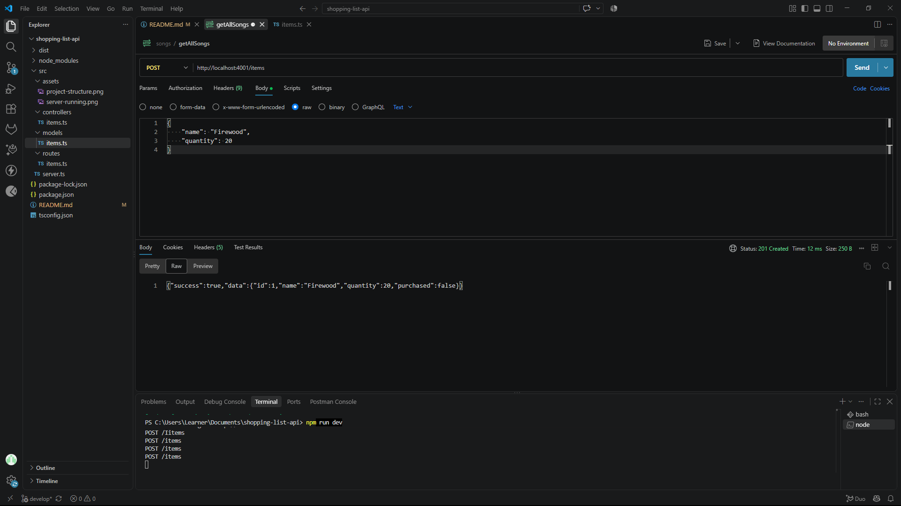
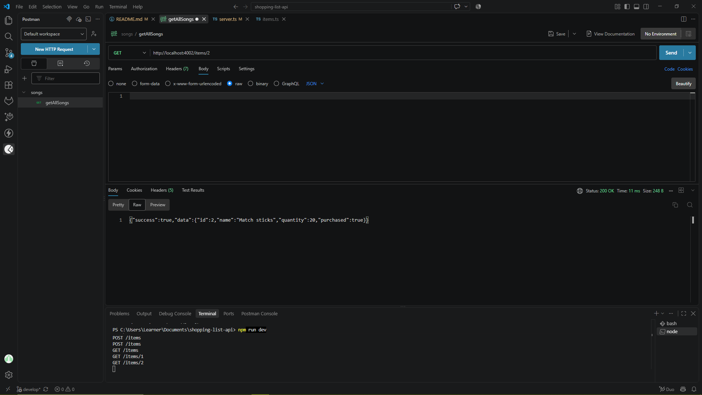
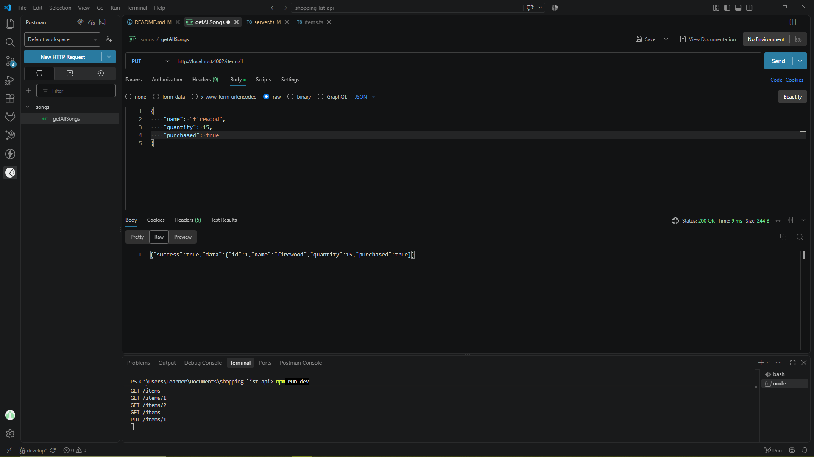
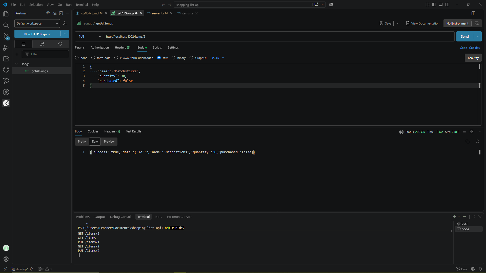
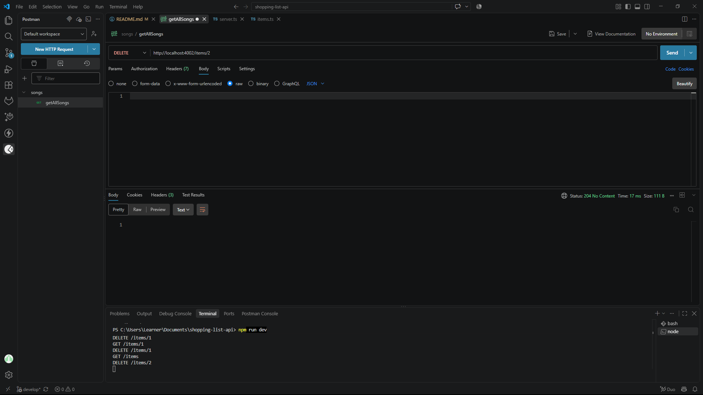
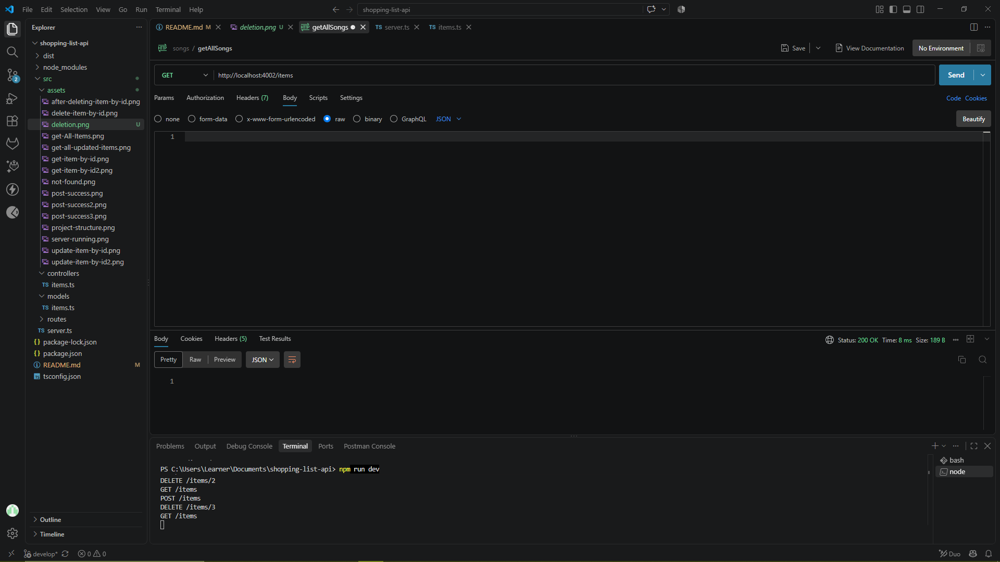

# Shopping List API

A REST API built with **Node.js** and **TypeScript** that allows users to manage list items through HTTP requests.

The API supports creating, viewing, updating, and deleting shopping list items. Data is stored **in memory**, so all items are reset whenever the server restarts.

---

## Project Overview

The purpose of this project is to build a simple shopping list REST API.

Users can interact with the API using tools such as **Postman**

The API allows users to:

- Add shopping list items
- View all shopping list items
- View a single item by ID
- Update an item's name, quantity, or purchased status
- Delete items
- Receive validation errors for invalid input

Example items:

```JSON
{
    "id": 1,
    "name": "Milk",
    "quantity": 2,
    "purchased": false
}
```

---

## Technologies Used

- Node.js
- TypeScript
- Node.js built-in HTTP module
- Nodemon
- ts-node
- Postman

---

## Project Structure

```text
shopping-list-api
    dist/
        controllers/
            items.js
            items.js.map
        models/
            items.js
            items.js.map
        routes/
            items.js
            items.js.map
        server.js
        server.ja.map
    node_module/
    src/
        assets/
        controllers/
            items.ts
        models/
            items.ts
        routes/
            items.ts
        server.ts
    package-lock.json
    package.json
    README.md
    tsconfig.json

```

### Project structure screenshot



---

## Item Model

```ts

export interface Item {
    id: number;
    name: string;
    quantity: number;
    purchased: boolean;
}

```

| Property | Type | Description |
|---|---|---|
| `id` | number | Unique ID generated by the server |
| `name` | string | Name of the shopping item |
| `quantity` | number | Quantity required |
| `purchased` | boolean | Shows whether the item ha been purchased |

---

## Installation

Clone the repository

```bash

git clone https://github.com/surprise2024-cpu/shopping-list-api.git

```

Move into the project folder:

```bash

cd shopping-list-api

```

Install dependencies

```bash

npm install

```

---

## Running the Project

To run the application in development mode:

```bash

npm run dev

```

The server runs on:

```text

http://localhost:4002

```

### Server Running 



---

## Build the project

Compile the TypeScript project:

```bash

npm run build

```

Compile JavaScript file are generated inside the:

```text

dist/

```

folder.

To run the compiled application:

```bash

npm start

```

---

## API Endpoints

| Method | Endpoint | Description |
|---|---|---|
| POST | `/items` | Add a new shopping list item |
| GET | `/items` | Retrieve all shopping list items |
| GET | `/items/:id` | Retrieve a single item by id  |
| PUT | `/items/:id` | Update an existing item |
| DELETE | `/items:id` | Delete an item |

Base URL: 

```text

http://localhost:4002

```

---

### POST /items `screenshot`



The `purchased` value is optional and it's automatically set to `false`.

---

### GET /items `screenshot`

Retrieve all items from the list.


---

### GET single item `screenshots`

Retrieve Item 1:

[GET item 1 by ID](./src/assets/get-item-by-id.png)

Retrieve Item 2:



---

### PUT /items/:id `screenshots`

Retrieve item by id the update that item.

---

Before:


After:



---

Before:


After:



---

### DELETE /items/:id `screenshots`

Delete an item using its ID.

Before:


Process:



After:



---

## Author

Shopping List API built using Node.js and TypeScript.


